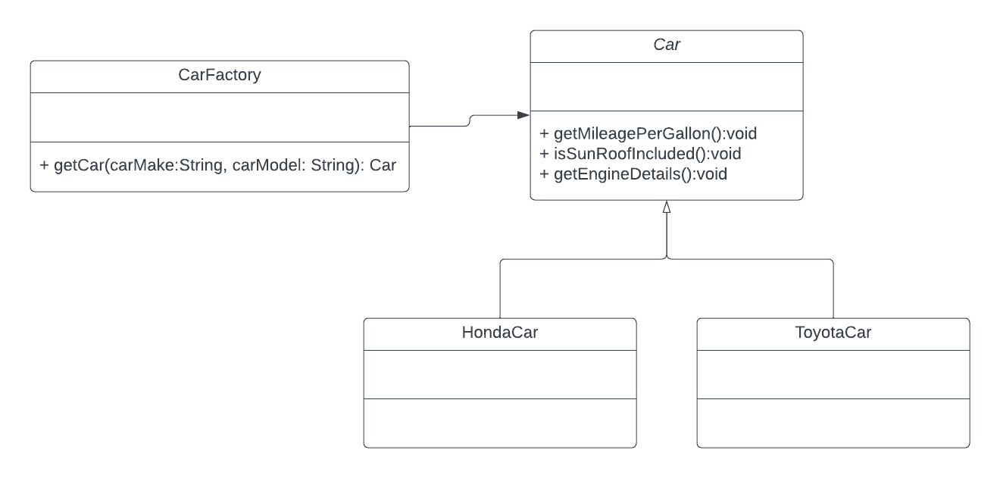

# design-pattern-AbstactFactory

<h3>This project descibe an implementation of<h3>
<li>Factory Object</li>
<li>Factory Method Pattern</li>
<li>Abstract Factory</li>
<h4>Implentation of Factory Object can be found under package com.company.factoryObject</h4>

 <b>Story:</b> It's been a long time since you plan to get yourself a car.
    Today, you decided to visit a car store to look for different types of vehicles.
    In CarStore you will select a Car and Car store with provide brief description about it.
    CarStore is expecting a detail of model and make of the car then it will delegate the work to 
    CarFactory which will provide the required information. 

<b>UML:</b>

